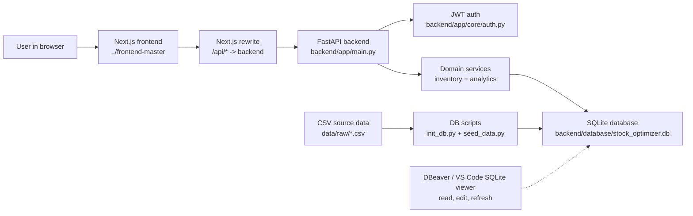
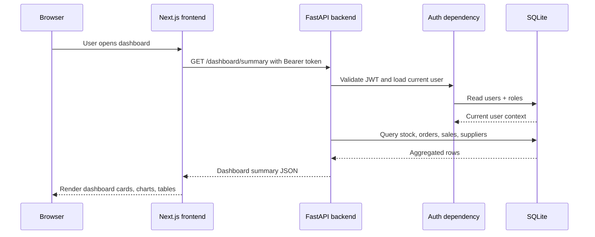
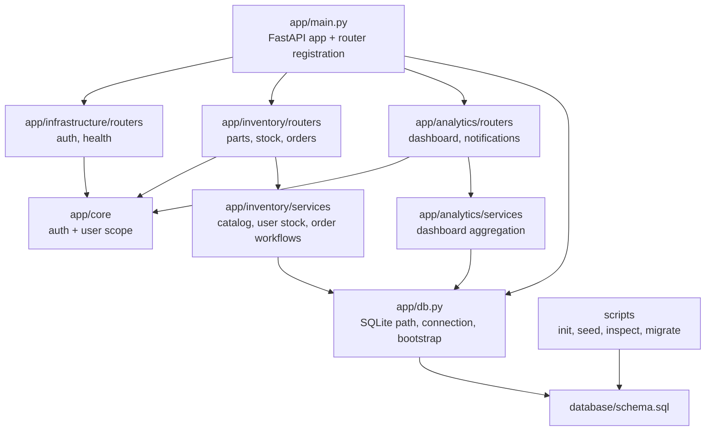
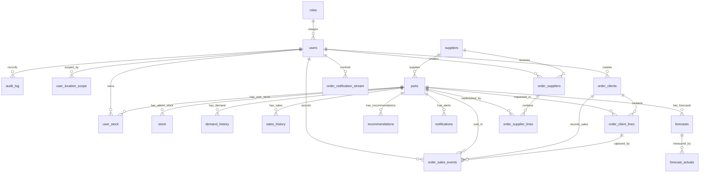
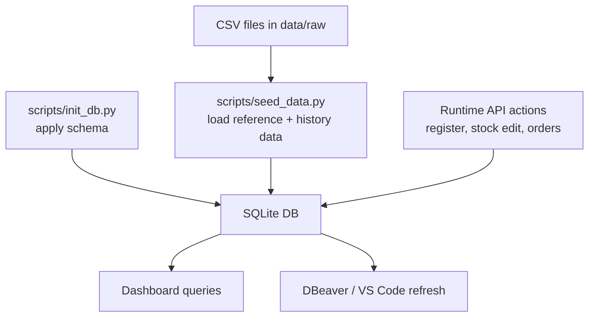
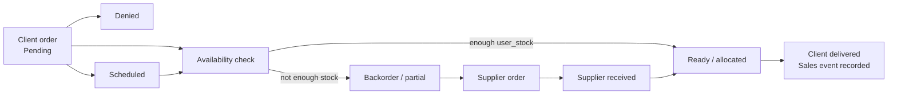
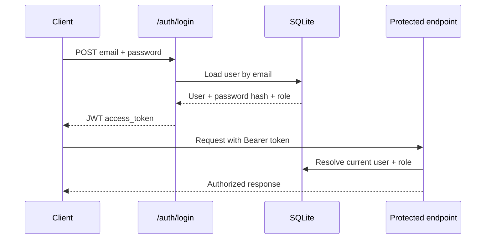

# Stock Optimizer Architecture

This document describes the current application architecture as it exists in this workspace. It is written for backend developers who need to understand how the frontend, API, database, CSV seed data, and local tooling fit together.

The short version: the app is a local inventory and order workflow system for automotive parts. A Next.js frontend talks to a FastAPI backend through `/api/...` calls. The backend owns authentication, inventory rules, order workflows, dashboard data, and all writes to the SQLite database.

## 1. System At A Glance



### Main Runtime Pieces

| Layer | Technology | Current Location | Responsibility |
|---|---|---|---|
| Frontend | Next.js, React, TypeScript | `..\frontend-master` | UI, pages, forms, dashboard state, calls to `/api/...` |
| API | FastAPI, Uvicorn | `backend/app` | HTTP endpoints, validation, auth checks, workflow orchestration |
| Domain logic | Python services | `backend/app/inventory/services`, `backend/app/analytics/services` | Stock logic, catalog shaping, order flows, dashboard aggregates |
| Database | SQLite | `backend/database/stock_optimizer.db` | Local persisted application state |
| Schema | SQL | `backend/database/schema.sql` | Tables, indexes, constraints |
| Seed data | CSV | `data/raw` | Initial parts, suppliers, stock, sales, weather, calendar data |
| Local DB viewer | DBeaver / VS Code | External tool | Inspect tables, run queries, verify live changes |

## 2. Repository Shape

The app is split across the backend project and a sibling frontend project.

```text
Stock_Optimizer/
|-- backend/
|   |-- app/
|   |   |-- main.py
|   |   |-- db.py
|   |   |-- core/
|   |   |-- infrastructure/
|   |   |-- inventory/
|   |   `-- analytics/
|   |-- database/
|   |   |-- schema.sql
|   |   `-- stock_optimizer.db
|   |-- scripts/
|   |-- tests/
|   |-- API.md
|   |-- DATABASE.md
|   `-- ARCHITECTURE.md
|-- data/
|   `-- raw/
|-- ml/
|-- RUN_LOCAL.md
|-- README.md
`-- APP_ARCHITECTURE.md

../frontend-master/
|-- src/
|   `-- app/
|       |-- context/DemoStoreContext.tsx
|       |-- dashboard/
|       |-- components/
|       `-- pages/
|-- next.config.mjs
|-- package.json
`-- tsconfig.json
```

The root `src/app/components` folder inside `Stock_Optimizer` currently does not appear to be the active frontend. The active frontend is the sibling folder `..\frontend-master`.

## 3. Frontend To Backend Flow

The frontend calls relative API paths such as `/api/auth/login`, `/api/stock`, and `/api/dashboard/summary`.

`..\frontend-master\next.config.mjs` rewrites those calls to the backend:

```text
/api/:path* -> http://localhost:8000/:path*
```

That means:

| Frontend call | Backend receives |
|---|---|
| `/api/auth/login` | `POST /auth/login` |
| `/api/parts/catalog` | `GET /parts/catalog` |
| `/api/stock` | `GET /stock` or `POST /stock` |
| `/api/orders/clients` | `GET /orders/clients` |
| `/api/dashboard/summary` | `GET /dashboard/summary` |



## 4. Backend Structure

The backend is organized by domain instead of by technical file type. That is a good choice for this project because inventory, analytics, and infrastructure each have different rules.



### Active Routers

These routers are currently registered in `backend/app/main.py`:

| Area | Router | Main Paths |
|---|---|---|
| Auth | `infrastructure.routers.auth` | `/auth/register`, `/auth/login`, `/auth/me` |
| Health | `infrastructure.routers.health` | `/health` |
| Parts | `inventory.routers.parts` | `/parts`, `/parts/catalog` |
| Stock | `inventory.routers.stock` | `/stock` |
| Orders | `inventory.routers.orders` | `/orders/clients`, `/orders/suppliers` |
| Dashboard | `analytics.routers.dashboard` | `/dashboard/summary`, `/dashboard/sales-flow` |
| Notifications | `analytics.routers.notifications` | `/notifications` |

These modules exist but are not currently active because they are not registered in `main.py`:

| Module | Current Meaning |
|---|---|
| `inventory.routers.demand_history` | Removed during backend cleanup; historical table still exists in schema |
| `analytics.routers.forecasts` | Removed from active backend surface; forecasting remains future scope |
| `analytics.routers.recommendations` | Removed from active backend surface; recommendation generation remains future scope |
| `infrastructure.routers.admin` | Removed placeholder to keep infrastructure layer lean |
| `inventory.routers.suppliers` | Removed duplicate supplier CRUD router not used by active frontend |

## 5. Database Architecture

The active database is:

```text
backend\database\stock_optimizer.db
```

SQLite is file-based, so DBeaver and VS Code can open it directly. Backend writes are committed immediately, but database viewers usually need a manual refresh to show the newest rows.

The diagram below uses the declared SQLite foreign keys from `stock_optimizer.db`. Tables without declared foreign keys are still real tables; they are listed in the exact schema summary after the diagram.



### Exact Current Table Names

Checked from `sqlite_master` in `backend\database\stock_optimizer.db`:

```text
audit_log
calendar_daily
calendar_events
dataset_dictionary
demand_history
eu_locations
forecast_actuals
forecasts
inventory_snapshot
notifications
order_client_lines
order_clients
order_notification_stream
order_sales_events
order_supplier_lines
order_suppliers
parts
recommendations
roles
sales_history
stock
suppliers
user_location_scope
user_stock
users
weather_daily
```

### Live Schema Summary

This summary is based on `PRAGMA table_info` and `PRAGMA foreign_key_list` against the live database file.

| Table | Primary key | Declared foreign keys |
|---|---|---|
| `audit_log` | `id` | `user_id -> users.id` (`ON DELETE SET NULL`) |
| `calendar_daily` | `id` | None |
| `calendar_events` | `id` | None |
| `dataset_dictionary` | `id` | None |
| `demand_history` | `id` | `part_id -> parts.id` (`ON DELETE CASCADE`) |
| `eu_locations` | `location_id` | None |
| `forecast_actuals` | `id` | `forecast_id -> forecasts.id` (`ON DELETE CASCADE`) |
| `forecasts` | `id` | `part_id -> parts.id` (`ON DELETE CASCADE`) |
| `inventory_snapshot` | `id` | None |
| `notifications` | `id` | `part_id -> parts.id` (`ON DELETE CASCADE`) |
| `order_client_lines` | `id` | `order_id -> order_clients.id` (`ON DELETE CASCADE`); `part_id -> parts.id` (`ON DELETE RESTRICT`) |
| `order_clients` | `id` | `user_id -> users.id` (`ON DELETE SET NULL`) |
| `order_notification_stream` | `user_id` | `user_id -> users.id` (`ON DELETE CASCADE`) |
| `order_sales_events` | `id` | `order_client_id -> order_clients.id` (`ON DELETE CASCADE`); `order_client_line_id -> order_client_lines.id` (`ON DELETE CASCADE`); `user_id -> users.id` (`ON DELETE SET NULL`); `part_id -> parts.id` (`ON DELETE RESTRICT`) |
| `order_supplier_lines` | `id` | `order_id -> order_suppliers.id` (`ON DELETE CASCADE`); `part_id -> parts.id` (`ON DELETE RESTRICT`) |
| `order_suppliers` | `id` | `supplier_id -> suppliers.id` (`ON DELETE SET NULL`); `user_id -> users.id` (`ON DELETE SET NULL`) |
| `parts` | `id` | `supplier_id -> suppliers.id` (`ON DELETE SET NULL`) |
| `recommendations` | `id` | `part_id -> parts.id` (`ON DELETE CASCADE`) |
| `roles` | `id` | None |
| `sales_history` | `id` | `part_id -> parts.id` (`ON DELETE SET NULL`) |
| `stock` | `(part_id, location)` | `part_id -> parts.id` (`ON DELETE CASCADE`) |
| `suppliers` | `id` | None |
| `user_location_scope` | `(user_id, location_id)` | `user_id -> users.id` (`ON DELETE CASCADE`) |
| `user_stock` | `id` | `user_id -> users.id` (`ON DELETE CASCADE`); `part_id -> parts.id` (`ON DELETE CASCADE`) |
| `users` | `id` | `role_id -> roles.id` (`ON DELETE RESTRICT`) |
| `weather_daily` | `id` | None |

Tables with no declared foreign keys can still contain logical reference columns. For example, `inventory_snapshot` has `sku` and `supplier_id`, and the calendar/weather tables have `location_id`, but SQLite does not enforce those relationships in the current `stock_optimizer.db` schema.

### Exact Column Names

Column order below comes from `PRAGMA table_info` on the live database:

```text
audit_log:
  id, user_id, action, table_name, record_id, details, created_at

calendar_daily:
  id, timestamp, timestamp_utc, date, location_id, city, country_code,
  is_payday, is_payday_window, is_holiday, is_school_holiday, event_name,
  event_type, affected_categories, event_multiplier, promotion_flag,
  service_campaign_flag

calendar_events:
  id, timestamp, timestamp_utc, date, location_id, city, country_code,
  is_payday, is_payday_window, is_holiday, is_school_holiday, event_name,
  event_type, affected_categories, event_multiplier, promotion_flag,
  service_campaign_flag

dataset_dictionary:
  id, file, column_name, description

demand_history:
  id, part_id, sale_date, location, location_type, sales_quantity

eu_locations:
  location_id, city, country, country_code, timezone, latitude, longitude,
  climate_zone, demand_scale, temp_mean_c, temp_amplitude_c,
  winter_start_month, winter_end_month, salary_days, payday_last_business_day

forecast_actuals:
  id, forecast_id, actual_demand, measured_at

forecasts:
  id, part_id, forecast_date, horizon_days, predicted_demand,
  confidence_score, generated_at

inventory_snapshot:
  id, snapshot_timestamp, snapshot_timestamp_utc, snapshot_date, location_id,
  city, country_code, sku, part_name, category, supplier_id, current_stock,
  reorder_point, safety_stock, optimal_stock, min_order_qty, lead_time_days,
  pending_order_qty, stockout_days_history, total_sales_history,
  latent_demand_signal_history, inventory_status

notifications:
  id, part_id, severity, message, created_at

order_client_lines:
  id, order_id, part_id, sku, part_name, quantity, unit_price,
  allocated_quantity, shortage_quantity

order_clients:
  id, client_name, user_id, location, requested_time, status, scheduled_for,
  stock_applied, created_at, updated_at, fulfillment_status,
  shortage_quantity, notes

order_notification_stream:
  user_id, last_generated_at, next_kind, created_at, updated_at

order_sales_events:
  id, order_client_id, order_client_line_id, user_id, part_id, sku,
  part_name, category, location, quantity_sold, unit_price, revenue_eur,
  sold_at, created_at

order_supplier_lines:
  id, order_id, part_id, sku, part_name, quantity, unit_price,
  received_quantity

order_suppliers:
  id, supplier_id, supplier_name, user_id, location, status,
  estimated_arrival, postponed_until, received_at, stock_applied,
  created_at, updated_at, notes, source_client_order_id

parts:
  id, sku, part_name, category, seasonality_profile, base_demand,
  supplier_id, unit_price, salary_sensitivity, lead_time_days,
  min_order_qty, criticality

recommendations:
  id, part_id, action, quantity, source_location, target_location, reason,
  created_at

roles:
  id, role_name, description

sales_history:
  id, timestamp, timestamp_utc, date, sku, part_id, part_name, category,
  seasonality_profile, location_id, city, country, country_code,
  climate_zone, quantity_sold, latent_demand_signal, unit_price_eur,
  revenue_eur, stock_on_hand_end, stockout_flag, day_of_week, day_name,
  day_of_month, week_of_year, month, quarter, year, season, is_weekend,
  temperature_c, temp_change_1d_c, temp_change_3d_c, abs_temp_change_3d_c,
  rain_mm, snow_cm, cold_snap_flag, heatwave_flag, weather_spike_flag,
  temperature_drop_flag, temperature_rise_flag, is_payday, is_payday_window,
  is_holiday, is_school_holiday, event_name, event_type,
  affected_categories, event_multiplier, promotion_flag,
  service_campaign_flag, fuel_price_eur_l, mobility_index,
  mean_demand_before_stock, weather_spike_applied, salary_spike_applied,
  calendar_spike_applied

stock:
  part_id, location, location_id, city, country_code, current_stock,
  reorder_point, safety_stock, optimal_stock, min_order_qty, lead_time_days,
  pending_order_qty, stockout_days_history, total_sales_history,
  latent_demand_signal_history, inventory_status, avg_daily_demand_30d,
  last_updated

suppliers:
  id, supplier_code, supplier_name, country_code, reliability_score,
  avg_delay_days, avg_on_time_rate, default_lead_time_days, updated_at

user_location_scope:
  user_id, location_id, location, created_at

user_stock:
  id, user_id, part_id, location, location_id, current_stock, reorder_point,
  safety_stock, optimal_stock, min_order_qty, lead_time_days,
  pending_order_qty, notes, created_at, updated_at

users:
  id, full_name, company, username, email, password_hash, role_id,
  is_active, created_at, updated_at

weather_daily:
  id, timestamp, timestamp_utc, date, location_id, city, country_code,
  climate_zone, temperature_c, temp_change_1d_c, temp_change_3d_c,
  abs_temp_change_3d_c, rain_mm, snow_cm, cold_snap_flag, heatwave_flag,
  weather_spike_flag, temperature_drop_flag, temperature_rise_flag
```

### Table Groups

| Group | Tables | Purpose |
|---|---|---|
| Security and access | `roles`, `users`, `user_location_scope`, `audit_log` | Auth, role checks, location scope, audit trail |
| Master data | `suppliers`, `parts`, `eu_locations` | Stable catalog and location reference data |
| Inventory operations | `stock`, `user_stock`, `inventory_snapshot` | Imported stock baseline and per-user editable stock |
| Order workflows | `order_clients`, `order_client_lines`, `order_suppliers`, `order_supplier_lines`, `order_notification_stream`, `order_sales_events` | Client orders, supplier replenishment, generated workflow notifications, completed sales |
| Analytics history | `sales_history`, `demand_history`, `weather_daily`, `calendar_daily`, `calendar_events`, `dataset_dictionary` | CSV-backed historical and explanatory data |
| Planning outputs | `forecasts`, `forecast_actuals`, `recommendations`, `notifications` | Future ML/planning outputs and current alert rows |

### Important Stock Split

There are two stock concepts:

| Table | Meaning |
|---|---|
| `stock` | Imported/admin stock baseline, seeded from `inventory_snapshot.csv` |
| `user_stock` | A normal user's own store stock, changed by the app and order workflows |

For the current frontend, normal users mostly interact with `user_stock`. The catalog still comes from `parts`, enriched with user-specific stock when available.

## 6. Data Lifecycle



Default startup behavior is intentionally non-destructive:

| Environment Variable | Default | Effect |
|---|---|---|
| `AUTO_BOOTSTRAP_DB` | `true` | Apply schema automatically on backend startup |
| `RESET_DB_ON_START` | `false` | Keep users, stock edits, and workflow orders |
| `REFRESH_CSV_ON_START` | `false` | Avoid reloading large CSV history tables every start |

Use reset only when you intentionally want a clean demo database:

```powershell
cd backend
py scripts\init_db.py --reset
py scripts\seed_data.py --reset
```

## 7. Order Workflow

The order workflow is the most important backend behavior after auth and stock.



### What Happens On Key Actions

| User Action | Backend Effect |
|---|---|
| Add or edit stock | Upserts or patches `user_stock` |
| Approve client order | Checks availability, allocates stock when possible, may create replenishment |
| Complete client order | Writes `order_sales_events`, used by dashboard sales flow |
| Create supplier order | Inserts `order_suppliers` and `order_supplier_lines` |
| Receive supplier order | Adds received quantities into `user_stock` |
| Notification refresh | Can generate timed demo workflow notifications when `generate=true` |

The frontend polls order and notification-related state. There is no WebSocket or server-sent event channel at the moment.

## 8. Authentication And Authorization



Current auth responsibilities:

| Area | Location |
|---|---|
| Password hashing | `backend/app/core/auth.py` |
| JWT creation and validation | `backend/app/core/auth.py` |
| Current user dependency | `backend/app/core/auth.py` |
| Role checks | `require_authenticated_user`, `require_admin`, `require_user_or_supplier` |
| Location scope | `backend/app/core/user_scope.py` |

Secrets should stay in `.env`, not committed to Git.

## 9. Local Backend Setup

As a backend developer on this project, you should have these tools ready:

| Tool | Why It Helps | Required |
|---|---|---|
| Python 3 | Run FastAPI, scripts, tests | Yes |
| Project virtual environment | Keeps backend dependencies isolated | Yes |
| VS Code | Code editing and integrated terminal | Yes |
| DBeaver CE | Inspect and query SQLite comfortably | Strongly recommended |
| Postman, Bruno, or Thunder Client | Test API requests with Bearer tokens | Strongly recommended |
| Git | Track changes and compare branches | Yes |
| Docker Desktop | Run backend through Docker Compose | Optional |
| SQLite CLI | Quick terminal queries | Optional |
| Mermaid preview support | Render architecture diagrams in Markdown | Optional |

Recommended daily backend windows:

| Window | Command Or Tool |
|---|---|
| Backend server | `cd backend` then `py -m uvicorn app.main:app --reload` |
| Frontend server | `cd ..\frontend-master` then `npm run dev` |
| API docs | `http://localhost:8000/docs` |
| App UI | `http://localhost:3000` |
| Database viewer | DBeaver connection to `backend\database\stock_optimizer.db` |

## 10. Backend Commands

Start the backend:

```powershell
cd backend
.\venv\Scripts\Activate.ps1
py -m uvicorn app.main:app --reload
```

Run tests:

```powershell
cd backend
.\venv\Scripts\python.exe -m pytest -q
```

Inspect the database from the terminal:

```powershell
cd backend
py scripts\view_db.py
```

Check backend import and route registration:

```powershell
cd backend
py -B -c "from app.main import app; print('routes', len(app.routes))"
```

## 11. What Is Necessary Next

The current architecture is good for a local demo and learning project. These are the most useful next backend improvements if the project keeps growing:

| Priority | Improvement | Why |
|---|---|---|
| High | Add explicit migration files | `schema.sql` is fine now, but migrations make changes safer over time |
| High | Increase tests around order workflows | Stock allocation, backorders, and supplier receiving are business-critical |
| High | Use Pydantic settings for config | Centralizes `.env` handling and avoids scattered `os.getenv` calls |
| Medium | Add structured logging | Easier debugging for order and stock changes |
| Medium | Add API response schemas consistently | Better Swagger docs and safer frontend contracts |
| Medium | Add CI test run | Prevents accidental regressions before merging |
| Medium | Add a development seed profile | Smaller seed data would make local reset faster |
| Future | Add WebSocket or SSE notifications | True live UI notifications instead of polling |
| Future | Move from SQLite to PostgreSQL if multi-user production use is needed | Better concurrency, migrations, monitoring, and deployment options |
| Future | Connect ML forecasting pipeline | Existing `forecasts`, `forecast_actuals`, and `recommendations` tables are ready for it |

## 12. Practical Ownership Rules

These rules keep the app clean as it grows:

| Rule | Meaning |
|---|---|
| Backend owns data truth | The frontend should not read SQLite directly |
| Frontend owns presentation | Backend should return clean data, not UI layout decisions |
| Services own workflow rules | Complex stock and order behavior should live in services, not router functions |
| Schema changes need docs | Update `backend/DATABASE.md` and this document when tables change |
| Runtime DB is generated | Do not commit `backend/database/stock_optimizer.db` |
| CSV refresh should be intentional | Avoid resetting demo data unless you need a clean start |

## 13. Current Architecture Summary

The app is currently a clean local full-stack system:

- Next.js provides the UI and calls `/api/...`.
- Next.js rewrites API calls to FastAPI.
- FastAPI registers domain routers for auth, inventory, orders, dashboard, KPIs, and notifications.
- Domain services coordinate stock, catalog, orders, and dashboard aggregation.
- SQLite stores both seeded reference data and live demo workflow data.
- CSV files provide the initial data foundation.
- DBeaver is the right local tool for inspecting live database state.

The most important backend idea is the separation between imported catalog/admin data and user-owned runtime data. `parts`, `suppliers`, and `stock` give the seeded operating baseline. `user_stock`, client orders, supplier orders, notifications, and order sales events represent the live behavior created by users while the demo runs.
