# Stock Optimizer Technical Architecture Document

## 0. How to Read This Document

This document is intentionally layered from broad context to deep technical detail.

### Suggested Reading Paths

- 5-minute overview: Sections 1, 2, 3, 7, 17
- Architecture deep dive: Sections 4, 5, 18, 19, 23, 24, 25, 26
- Runtime behavior and workflows: Sections 6, 20, 30
- Engineering quality and operations: Sections 9, 10, 12, 29, 31, 32, 33
- Strategy and future direction: Sections 14, 16, 34, 35, 36

### Document Flow Map

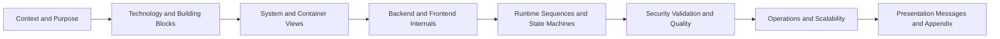

### Section Groups

| Group | Focus | Primary Sections |
|---|---|---|
| Foundation | Purpose, stack, high-level architecture | 1-4 |
| Core Design | Backend modules, APIs, data model | 5-8 |
| Runtime and Behavior | Internal architecture, sequence and state flows | 18-27, 30 |
| Cross-Cutting Concerns | Security, validation, quality, failure handling | 9-12, 29, 31, 32 |
| Operations and Evolution | Deployment, observability, scalability roadmap | 13, 33, 34 |
| Decision and Presentation Layer | ADRs, key messages, cleanup rules | 14, 16, 28, 35, 36 |

## Part I - Foundation

> **One-Slide Summary — Part I**
> - Stock Optimizer solves three operational problems: inventory visibility, order workflow orchestration, and decision-support analytics for auto parts teams
> - Full-stack: Next.js 16.2.4 + FastAPI 0.115.0 + SQLite, reproducibly seeded from CSV data
> - All communication flows through JWT-authenticated REST; the frontend rewrites `/api/*` to the backend at runtime
> - Architecture is domain-oriented, contract-first, and optimized for local development and technical demos

### 1. System Purpose

> **Purpose:** Establish why this system exists and which operational problems it directly solves.
> **Key Takeaway:** Three tightly-scoped problem domains — visibility, workflow, decision support — define the entire system surface.
> **Risk:** Scope is intentionally narrow; expanding into new problem domains requires explicit architectural decisions at each step.

Stock Optimizer is a technical full-stack application for automotive inventory operations.
It solves three core operational problems:

1. Inventory visibility per location and per part
2. Client and supplier order workflow orchestration
3. Decision support via dashboard aggregates and notification streams

The current implementation is optimized for local development and technical demos, using SQLite plus seeded CSV datasets.

## 2. Technology Stack and Why It Was Chosen

> **Purpose:** Document the concrete technology choices and the reasoning behind each selection.
> **Key Takeaway:** Every choice prioritizes speed of iteration, local-first developer experience, and explicit API contracts.
> **Risk:** SQLite and local-only JWT limit production readiness; migration paths for both exist but require deliberate effort.

### Frontend

- Next.js (App Router): routing, SSR-ready structure, API rewrite support
- React: component-based UI and workflow screens
- TypeScript: static typing for API contracts and UI state
- motion: page and component transitions for UI state feedback
- lucide-react: icon system used across dashboard modules
- Tailwind CSS v4 + custom CSS tokens: layout primitives and theme implementation

### Backend

- FastAPI: explicit REST contract, automatic OpenAPI generation, fast iteration
- Pydantic: strict request validation and business-rule-level schema constraints
- Domain service layer in Python: isolates business workflows from transport layer
- Uvicorn: ASGI runtime for local and container execution
- PyJWT + bcrypt: token issuing and password hashing/verification

### Data and Tooling

- SQLite: simple, deterministic, local-first runtime persistence
- CSV seed pipeline: reproducible baseline data for parts, stock, demand, and analytics
- Pytest: endpoint and workflow regression verification
- Docker Compose: reproducible backend runtime containerization

### Concrete Runtime Versions in This Project

| Layer | Technology | Version |
|---|---|---|
| Frontend | next | 16.2.4 |
| Frontend | react / react-dom | 19.2.3 |
| Frontend | motion | 12.23.24 |
| Frontend | tailwindcss | 4.1.12 |
| Backend | fastapi | 0.115.0 |
| Backend | uvicorn | 0.30.0 |
| Backend | PyJWT | 2.8.0 |
| Backend | bcrypt | 4.1.1 |
| Testing | pytest | 8.3.3 |

## 3. High-Level Architecture

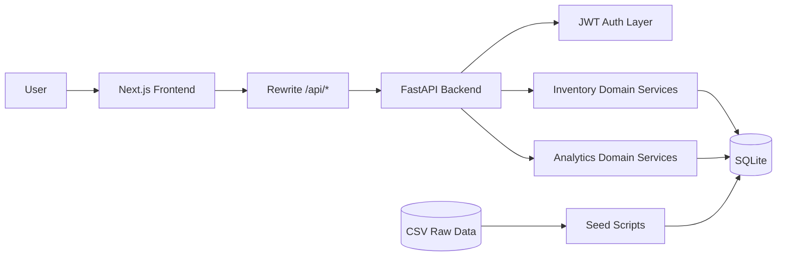

## 4. Container-Level Design

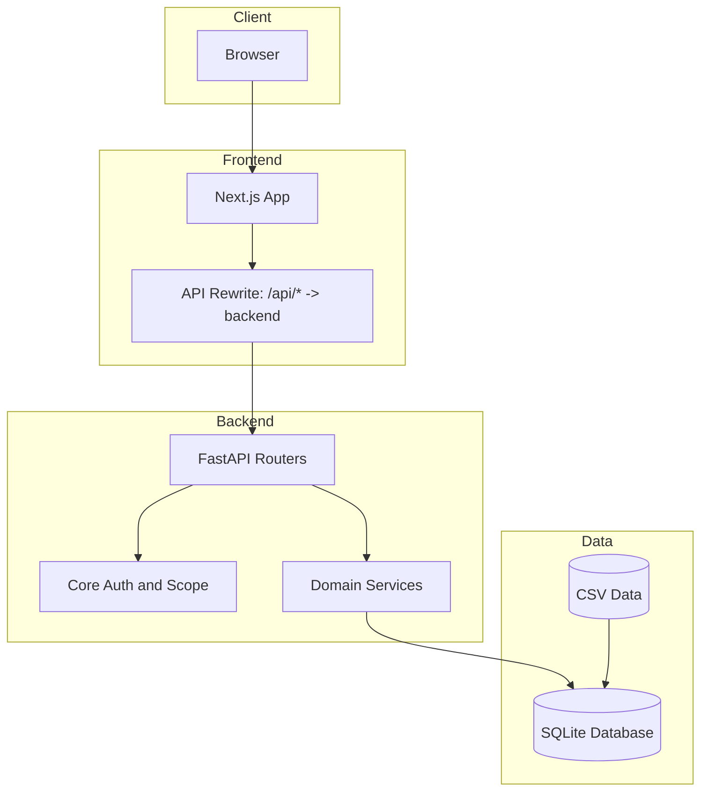

## Part II - Core Design

> **One-Slide Summary — Part II**
> - Backend organized into four domains: `core`, `infrastructure`, `inventory`, `analytics` — each with its own routers, schemas, and services
> - Every request follows a strict path: JWT auth → Pydantic validation → workflow service → SQLite
> - 35+ active endpoints across 7 routers, all aligned to active frontend usage; deprecated and legacy contracts removed
> - Schema-level validation enforces business rules before persistence; quantity integers, workflow guards, and scope restrictions are all enforced at the API boundary

### 5. Backend Module Architecture

> **Purpose:** Show how backend code is organized and why domain separation is the primary structuring principle.
> **Key Takeaway:** Router → service → DB is the consistent pattern across all four domains; business logic never leaks into routers.
> **Risk:** Cross-domain service reuse is not yet formalized; a shared utility pattern may be needed as the domain count grows.

The backend follows a domain-oriented package structure:

- core: JWT handling, user context, location scoping
- infrastructure: auth and health endpoints
- inventory: parts, stock, and order workflow APIs
- analytics: dashboard and notifications APIs

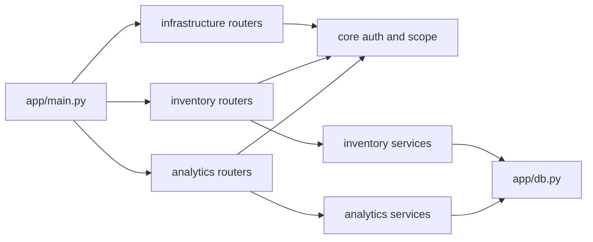

## 6. Runtime Request Lifecycle

> **Purpose:** Trace a real request from browser to database and back to show where each processing concern lives.
> **Key Takeaway:** The auth dependency executes before every protected operation; there is no bypass path through the current middleware chain.
> **Risk:** No request correlation IDs or structured tracing exist today; diagnosing cross-layer issues requires manual log correlation.

### Example: Authenticated Stock Update

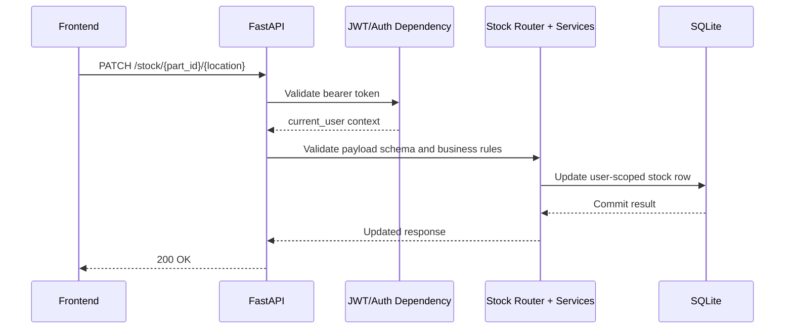

## 7. API Surface by Domain

> **Purpose:** Provide the complete active endpoint inventory organized by domain boundary.
> **Key Takeaway:** 35+ active endpoints across 7 domains, all aligned to live frontend usage; removed and deprecated contracts are tracked in Section 11.
> **Risk:** No API versioning strategy is in place; breaking changes affect all clients simultaneously without a migration window.

### Auth

- POST /auth/register
- POST /auth/login
- GET /auth/me

### Health

- GET /health

### Parts

- GET /parts
- GET /parts/catalog
- GET /parts/catalog/filters
- GET /parts/catalog/{part_id}
- GET /parts/{part_id}
- POST /parts (admin-gated)
- PATCH /parts/{part_id} (admin-gated)
- DELETE /parts/{part_id} (admin-gated)

### Stock

- GET /stock
- POST /stock
- GET /stock/{part_id}
- PATCH /stock/{part_id}/{location}
- DELETE /stock/{part_id}/{location}

### Orders

- GET /orders/clients
- POST /orders/clients
- POST /orders/clients/random
- GET /orders/clients/{order_id}/availability
- POST /orders/clients/{order_id}/approve
- POST /orders/clients/{order_id}/deny
- POST /orders/clients/{order_id}/schedule
- POST /orders/clients/{order_id}/complete
- GET /orders/suppliers
- POST /orders/suppliers
- POST /orders/suppliers/{order_id}/receive
- POST /orders/suppliers/{order_id}/postpone
- POST /orders/suppliers/{order_id}/refuse

### Analytics

- GET /dashboard/summary
- GET /dashboard/sales-flow
- GET /dashboard/market-trends
- GET /dashboard/supplier-locations
- GET /dashboard/priority-stock
- GET /notifications

## 8. Data Architecture

> **Purpose:** Map the runtime data entities and their relationships that back all active API operations.
> **Key Takeaway:** Core entities (users, parts, stock, orders) are tightly relational; analytics and history entities are append-only and read-heavy.
> **Risk:** SQLite schema is managed manually with no migration tooling; schema changes require direct file edits and a full re-seed.

### Core Runtime Entities

- users, roles, user_location_scope
- parts, suppliers
- stock, user_stock
- order_clients, order_client_lines
- order_suppliers, order_supplier_lines
- notifications, order_notification_stream, order_sales_events

### Analytics and History Entities

- sales_history, inventory_snapshot, demand_history
- forecasts, forecast_actuals, recommendations
- weather_daily, calendar_daily, calendar_events, eu_locations

### Logical Relationship View

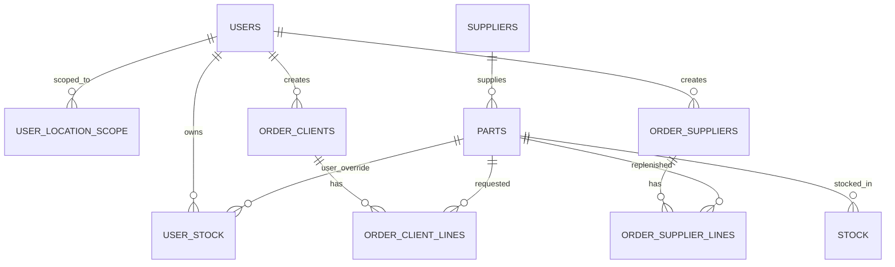

## 9. Security and Access Model

> **Purpose:** Describe how authentication and authorization are enforced at each processing layer.
> **Key Takeaway:** Three-layer guard — JWT token → role check → location scope — applies to every protected endpoint.
> **Risk:** No token refresh flow and no rate limiting on auth endpoints are the two highest-priority production security gaps.

1. Authentication: JWT bearer token for protected endpoints
2. Authorization basis: role plus location scope
3. User behavior: user data is location-scoped and record-scoped
4. Admin mutation gates: parts create/update/delete remain admin-gated
5. Anti-enumeration login behavior: invalid credentials return generic errors

## 10. Validation and Business Rules

> **Purpose:** Document the business constraints enforced at schema and router boundaries before any data reaches persistence.
> **Key Takeaway:** Rules live in Pydantic schemas and router guards, not only in the database; invalid state is rejected at the API boundary.
> **Risk:** Client applications must normalize inputs to match the contract; any relaxation of these constraints could reintroduce invalid domain state.

### Auth Rules

- Email format normalized and validated
- Strong password policy for registration

### Stock Rules

- Integer-only quantity semantics for stock management fields
- Non-negative constraints enforced
- Upper bounds prevent unrealistic operational values
- PATCH stock cannot mutate part identity or location identity

### Order Rules

- Workflow status transitions are constrained
- Availability, allocation, and completion have explicit guards
- Supplier receive/refuse/postpone actions are state-aware

## 11. Removed and Replaced API Contracts

The backend surface was intentionally simplified and aligned to active frontend usage.

- suppliers-info endpoints: removed
- GET /kpis: deprecated and replaced by GET /dashboard/summary
- GET /orders and POST /orders: replaced by split workflows:
  - /orders/clients
  - /orders/suppliers

This reduces ambiguity and keeps contracts aligned with actual workflows.

## 12. Testing and Quality Strategy

- Pytest validates auth, health, parts, and stock paths
- Schema and router changes are regression-tested
- API contract consistency is verified against OpenAPI output
- Local test target remains stable with SQLite-backed fixtures

## 13. Deployment and Local Runtime

### Local developer mode

1. Start backend with Uvicorn
2. Start frontend in sibling repository
3. Use API rewrite from frontend to backend

### Data bootstrap flow

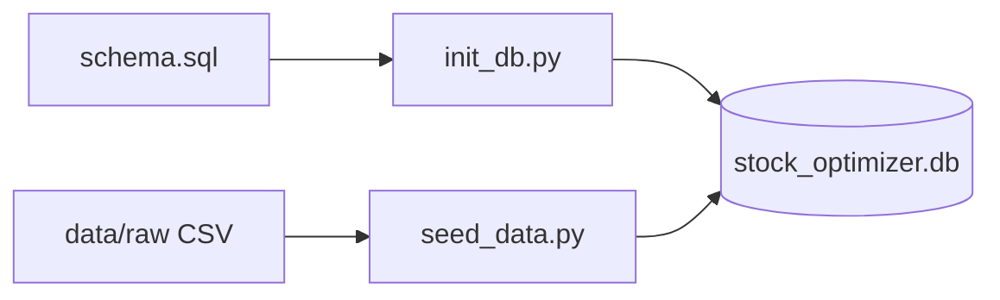

## 14. Engineering Trade-Offs

1. SQLite over server DB: faster local setup, lower ops overhead, limited horizontal scaling
2. Domain package architecture: better maintainability, slightly more indirection
3. Split orders API: clearer workflow semantics, more endpoints to manage
4. Strict schema constraints: safer runtime behavior, requires tighter payload discipline

## 15. Recommended Technical Demo Path

1. Register and login to obtain token
2. Show /auth/me to validate identity context
3. Show /parts and /parts/catalog responses
4. Create stock and update stock with valid integer payload
5. Show validation failure on invalid stock payload
6. Create and process a client order
7. Process supplier order receive/postpone/refuse
8. Show dashboard summary and notifications

## 16. Future Architecture Work

1. Introduce explicit API versioning strategy
2. Add structured observability (request IDs, metrics, traces)
3. Expand automated contract tests for all order transitions
4. Evaluate migration path from SQLite to production-grade relational DB
5. Introduce role provisioning policy if admin routes become operationally required

## 17. One-Paragraph Technical Summary

Stock Optimizer is a domain-structured Next.js + FastAPI system with JWT auth, location-scoped access control, workflow-driven order processing, and SQLite-backed persistence seeded from CSV datasets. The architecture prioritizes explicit API contracts, strict validation, and maintainable module boundaries, with deprecated endpoints removed and workflows split into clear client and supplier paths for better technical clarity and frontend alignment.

## Part III - Runtime and Behavior

> **One-Slide Summary — Part III**
> - DemoStoreContext is the true orchestration hub: all API calls, state normalization, and 60s polling flow exclusively through it
> - Full API contract map links every frontend user action to exactly one backend endpoint — no undocumented calls
> - Four sequence diagrams trace real runtime behavior: auth bootstrap, dashboard load, order approval with stock allocation, and notification polling
> - Class diagrams cover backend services, frontend context, and domain entities for a complete structural view at three levels

### 18. Frontend Internal Architecture (Detailed)

> **Purpose:** Explain how the frontend orchestrates backend interactions beyond simple UI rendering.
> **Key Takeaway:** DemoStoreContext is the single orchestration point; all API calls, state normalization, and refresh logic flow exclusively through it.
> **Risk:** A centralized context becomes a bottleneck if the application grows significantly in page count or data volume.

The frontend is not just a UI shell. It contains a client-side orchestration layer that normalizes backend contracts and drives workflow state.

### Frontend Runtime Building Blocks

1. Route layer (App Router pages)
- login/register routes for auth lifecycle
- dashboard routes for parts, stock, and orders operations

2. UI composition layer
- reusable components for KPI cards, panels, badges, and notifications

3. State and orchestration layer
- DemoStoreContext centralizes API calls and local normalized state
- one API utility injects Authorization headers and parses backend errors
- refresh loops synchronize orders, notifications, and dashboard snapshots

4. API gateway behavior
- frontend calls `/api/...`
- Next.js rewrites to backend base URL at runtime

### Frontend Component and State Flow

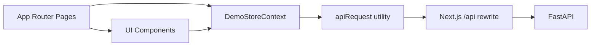

## 19. Backend Internal Architecture (Detailed)

> **Purpose:** Show the five-layer processing model inside the FastAPI backend and the separation of concerns at each layer.
> **Key Takeaway:** Each processing layer has a single responsibility; they are independently testable and replaceable without touching sibling layers.
> **Risk:** Service classes are not abstracted behind interfaces; replacement or mocking requires direct code changes rather than dependency substitution.

The backend follows transport -> validation -> workflow -> persistence boundaries.

### Request Processing Layers

1. Router layer
- receives HTTP requests
- binds path/query/body params

2. Dependency and auth layer
- validates bearer token
- resolves current user context (role and location scope)

3. Schema validation layer
- Pydantic rejects invalid structure and invalid business-level input ranges

4. Workflow service layer
- performs state transitions and cross-entity logic

5. Persistence layer
- executes SQL operations in SQLite and commits transactional updates

### Backend Processing Graph

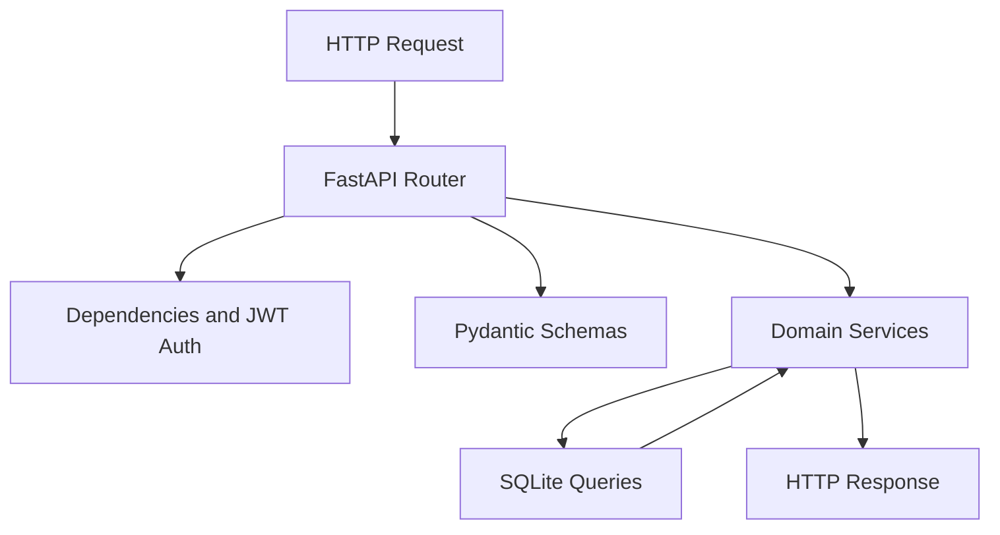

## 20. Behind-the-Scenes Sequence Diagrams

### 20.1 Register + Login + Identity Bootstrap

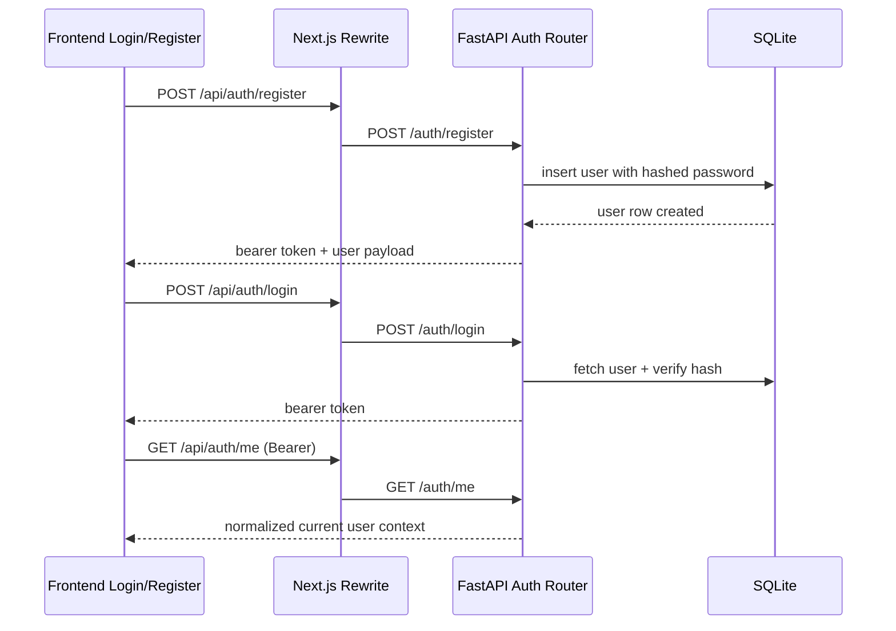

### 20.2 Dashboard Initial Load Orchestration

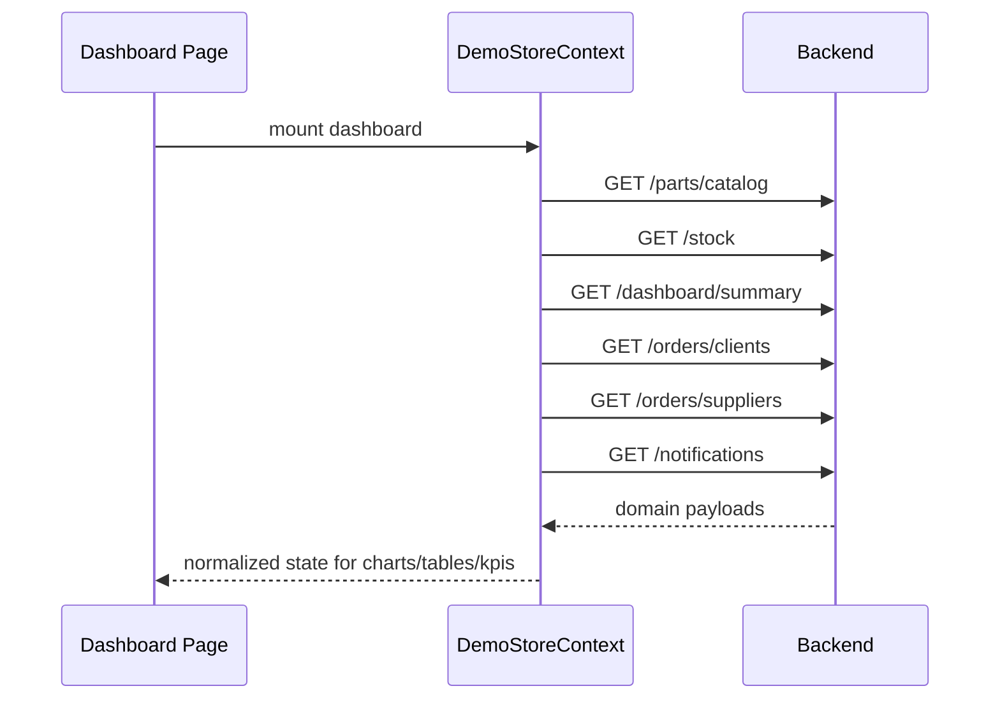

### 20.3 Client Order Approval with Stock Allocation

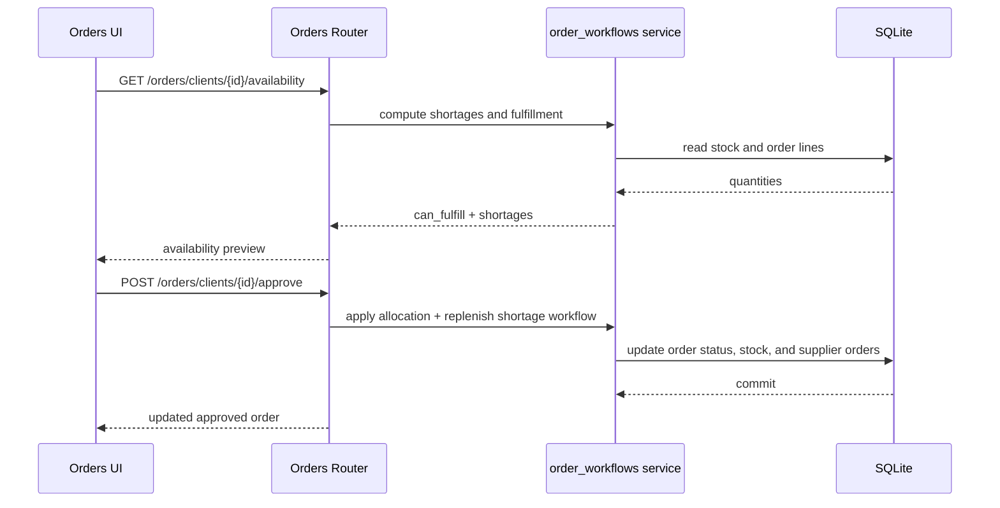

### 20.4 Notification Polling and Reactive Refresh

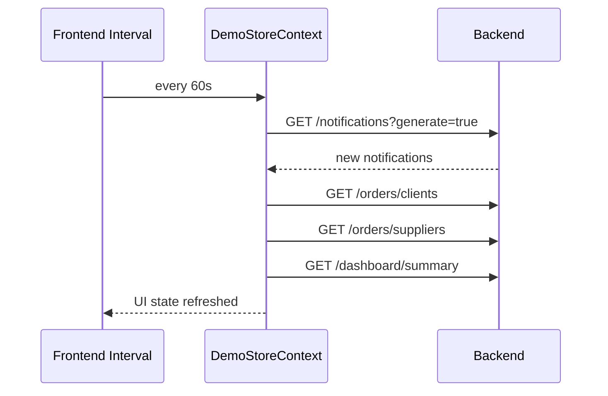

## 21. Frontend-to-Backend Contract Map

| Frontend Concern | Frontend Route/Context Behavior | Backend Endpoint |
|---|---|---|
| Registration | register form submit | POST /auth/register |
| Login | login form submit | POST /auth/login |
| Session identity | bootstrap current user | GET /auth/me |
| Catalog view | catalog fetch + filters | GET /parts/catalog, GET /parts/catalog/filters |
| Stock list | stock page data | GET /stock |
| Stock create | stock management add | POST /stock |
| Stock update | stock management edit | PATCH /stock/{part_id}/{location} |
| Stock delete | stock management remove | DELETE /stock/{part_id}/{location} |
| Client workflow list | orders page load | GET /orders/clients |
| Client availability | approval preview | GET /orders/clients/{order_id}/availability |
| Client transitions | approve/deny/schedule/complete | POST /orders/clients/... |
| Supplier workflow list | orders supplier tab | GET /orders/suppliers |
| Supplier transitions | receive/postpone/refuse | POST /orders/suppliers/... |
| Dashboard analytics | dashboard page KPIs/charts | GET /dashboard/summary |
| Notification center | polling + toasts | GET /notifications |

## 22. Smart Reading Guide for Presenters

Use this order while presenting to a technical audience:

1. Start from Sections 3 and 4 (system and container boundaries)
2. Continue with Sections 18 and 19 (real internal architecture)
3. Walk through Section 20 sequence diagrams in runtime order
4. Use Section 21 as proof of contract alignment
5. Finish with Sections 10, 11, and 14 for engineering quality and trade-offs

This reading order minimizes context switching and keeps architectural reasoning connected to live API behavior.

## 23. Detailed End-to-End Runtime Architecture

This section models the active runtime path only (no removed routers, no deprecated APIs).

### 23.1 Control Plane vs Data Plane

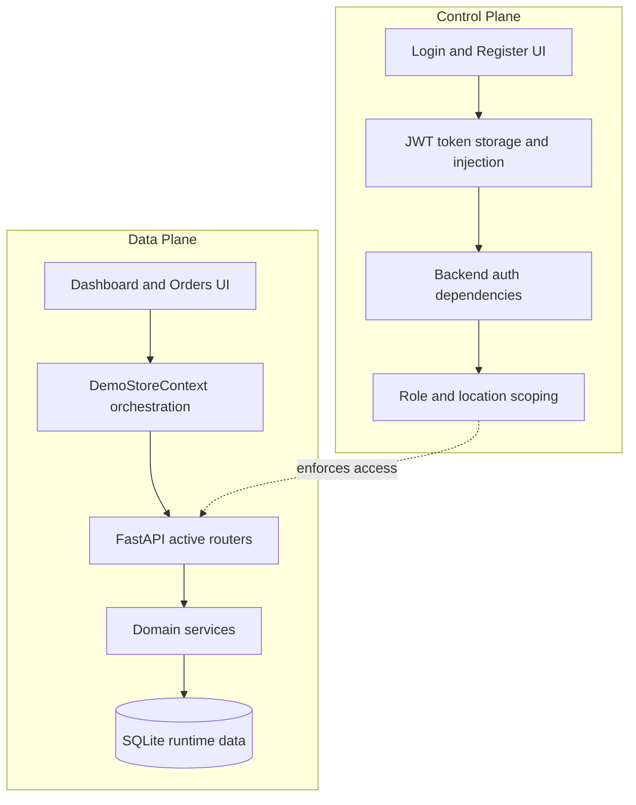

### 23.2 Active Backend Component Dependency Graph

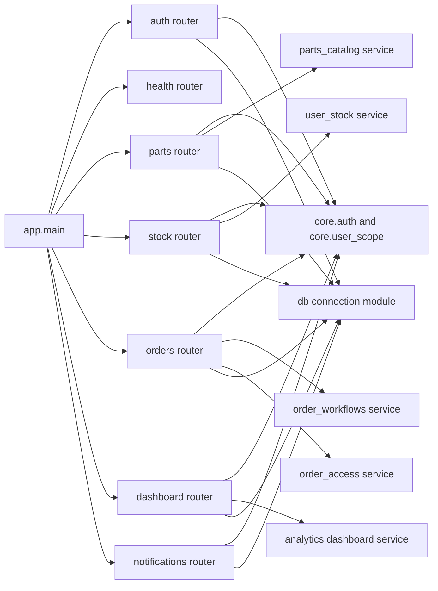

## 24. Backend Class Diagram (Active API Scope)

The diagram below is a logical class view for runtime collaboration in active APIs.

```mermaid
classDiagram
    class AuthRouter {
      +register(payload)
      +login(payload)
      +me(current_user)
    }

    class PartsRouter {
      +get_parts(current_user)
      +get_parts_catalog(filters)
      +get_part(part_id, current_user)
      +create_part(payload)
      +update_part(part_id, payload)
      +delete_part(part_id)
    }

    class StockRouter {
      +get_stock(current_user)
      +get_stock_for_part(part_id, current_user)
      +create_stock(payload, current_user)
      +update_stock(part_id, location, payload, current_user)
      +delete_stock(part_id, location, current_user)
    }

    class OrdersRouter {
      +list_client_orders(filters)
      +approve_client_order(order_id)
      +list_supplier_orders(filters)
      +receive_supplier_order(order_id)
    }

    class DashboardRouter {
      +dashboard_summary(current_user)
      +dashboard_sales_flow(current_user, params)
      +dashboard_market_trends(current_user, params)
      +dashboard_supplier_locations(current_user, params)
      +dashboard_priority_stock(current_user, params)
    }

    class NotificationsRouter {
      +get_notifications(current_user, generate)
    }

    class AuthCore {
      +require_authenticated_user()
      +get_current_user()
      +create_access_token(user_id, role)
      +verify_password(password, hash)
    }

    class PartsCatalogService {
      +list_catalog_parts(connection, user, filters)
      +get_catalog_part(connection, user, part_id)
      +get_catalog_filters(connection, user)
    }

    class UserStockService {
      +list_user_stock(connection, user)
      +patch_user_stock(connection, user, part_id, payload)
      +delete_user_stock(connection, user, part_id)
    }

    class OrderWorkflowsService {
      +create_client_order_record(db, payload, user)
      +apply_client_order_stock(db, order_id)
      +create_supplier_order_record(db, payload, user)
      +apply_supplier_order_stock(db, order_id)
    }

    class DashboardService {
      +get_dashboard_summary(connection, user)
      +get_sales_flow(connection, user, args)
      +get_market_trends(connection, user, limit)
      +get_supplier_map(connection, user, limit)
      +get_priority_stock(connection, user, limit)
    }

    class DBConnection {
      +get_connection()
    }

    class StockCreatePayload
    class StockUpdatePayload
    class PartCreatePayload
    class PartUpdatePayload
    class ClientOrderCreatePayload
    class SupplierOrderCreatePayload

    AuthRouter --> AuthCore
    PartsRouter --> AuthCore
    StockRouter --> AuthCore
    OrdersRouter --> AuthCore
    DashboardRouter --> AuthCore
    NotificationsRouter --> AuthCore

    PartsRouter --> PartsCatalogService
    StockRouter --> UserStockService
    OrdersRouter --> OrderWorkflowsService
    DashboardRouter --> DashboardService

    AuthRouter --> DBConnection
    PartsRouter --> DBConnection
    StockRouter --> DBConnection
    OrdersRouter --> DBConnection
    DashboardRouter --> DBConnection
    NotificationsRouter --> DBConnection

    StockRouter --> StockCreatePayload
    StockRouter --> StockUpdatePayload
    PartsRouter --> PartCreatePayload
    PartsRouter --> PartUpdatePayload
    OrdersRouter --> ClientOrderCreatePayload
    OrdersRouter --> SupplierOrderCreatePayload
```

## 25. Frontend Class Diagram (Runtime Collaboration)

This is a logical class diagram for the active frontend architecture.

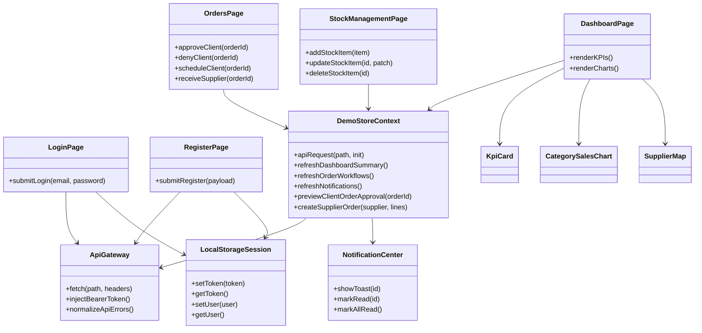

## 26. Domain Entity Class Diagram (Operational Data Model)

This diagram emphasizes runtime entities used by active APIs and workflows.

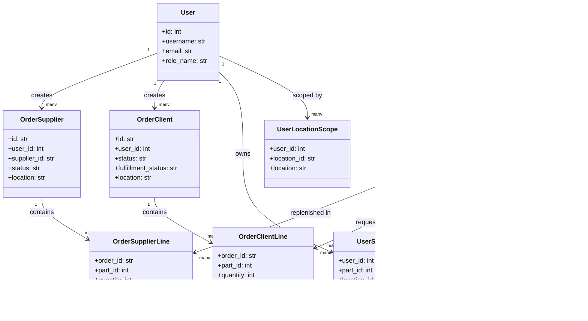

## 27. Notes for Future Class Diagram Cleanup

When you move to the cleanup step, remove classes that are not invoked by active routers and not touched by active frontend calls. For now, this document intentionally keeps only active runtime components and active workflow entities.

## Part IV - Architecture Governance

> **One-Slide Summary — Part IV**
> - Four ADRs capture the decisions that shaped this architecture: domain structure, split orders API, strict schema validation, and SQLite for local runtime
> - Quality attribute matrix shows intentional trade-offs with known limitations — nothing is hidden
> - Order lifecycle is modeled as explicit state machines; invalid transitions return structured errors with clear rejection reasons
> - Threat model covers five attack vectors with five active mitigations and a prioritized roadmap for production hardening

### 28. Architecture Decision Highlights (ADR-Style)

> **Purpose:** Record the key architectural decisions that shaped this system and make their trade-offs explicit.
> **Key Takeaway:** All four decisions have documented trade-offs; choices reflect deliberate prioritization of local simplicity over operational complexity.
> **Risk:** These ADRs are partially post-hoc; future decisions should be documented before implementation to prevent untracked divergence.

#### ADR-01: Domain-Oriented Backend Structure

- Decision: group code by business domain (`inventory`, `analytics`, `core`, `infrastructure`) instead of by technical layer only.
- Why: keeps workflows cohesive and reduces cross-module leakage.
- Trade-off: slightly more navigation overhead for developers used to controller/service/repository-only layouts.

#### ADR-02: Split Orders API by Workflow Type

- Decision: replace generic `/orders` endpoints with `/orders/clients` and `/orders/suppliers`.
- Why: explicit lifecycle semantics and cleaner state transition logic.
- Trade-off: higher endpoint count.

#### ADR-03: Strict Schema Validation at API Boundary

- Decision: enforce quantity constraints and business guards in Pydantic schemas and router checks.
- Why: avoids invalid domain state entering persistence.
- Trade-off: stricter payload contract requires clients to normalize inputs.

#### ADR-04: SQLite for Local Runtime

- Decision: use SQLite as the active runtime data store in this stage.
- Why: low setup complexity, deterministic local behavior, easy demo reproducibility.
- Trade-off: limited horizontal scaling and concurrency compared to server-grade RDBMS.

## 29. Quality Attributes and How This Architecture Supports Them

> **Purpose:** Map each quality goal to a current mechanism and identify where the architecture has intentional gaps.
> **Key Takeaway:** Security and modifiability are well-supported; operability and performance have deliberate current limitations tied to the SQLite single-node runtime.
> **Risk:** Without active metrics collection, quality regressions may not surface until they visibly affect demo or production behavior.

| Quality Attribute | Target | Current Mechanism | Current Limitation |
|---|---|---|---|
| Modifiability | Add workflows with low regression risk | Domain services + router separation | No automated architecture rules yet |
| Reliability | Predictable runtime behavior | Input validation + guarded transitions | Limited runtime observability |
| Security | Protect scoped business data | JWT auth + location scoping + role gates | No refresh-token flow yet |
| Performance | Fast local API response | SQLite + focused queries | Not tuned for distributed scale |
| Testability | Repeatable endpoint checks | Pytest + deterministic seed model | Needs broader order-transition coverage |
| Operability | Fast local startup and diagnosis | simple stack + explicit endpoints | No centralized logs/metrics stack |

## 30. State Machine Diagrams (Workflow Semantics)

> **Purpose:** Define the precise, enforceable state transitions for client and supplier order workflows.
> **Key Takeaway:** Every status transition is guarded in workflow service code; invalid transitions return structured 400 errors with explicit rejection reasons.
> **Risk:** State machine logic lives in service code, not a formal state machine library; behavioral consistency requires manual discipline during changes.

### 30.1 Client Order State Machine

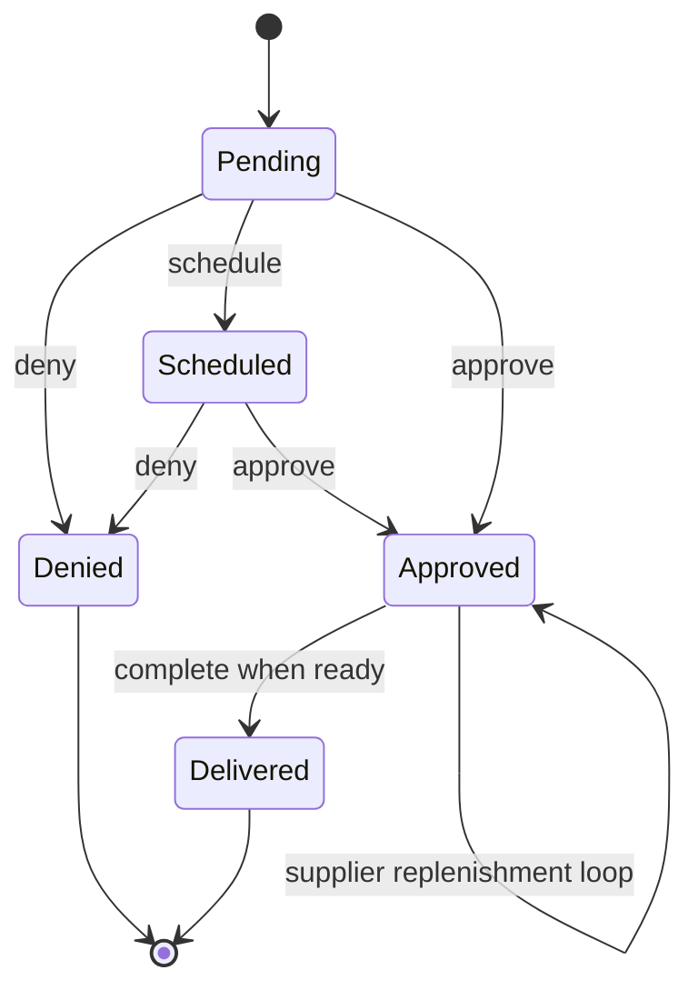

### 30.2 Supplier Order State Machine

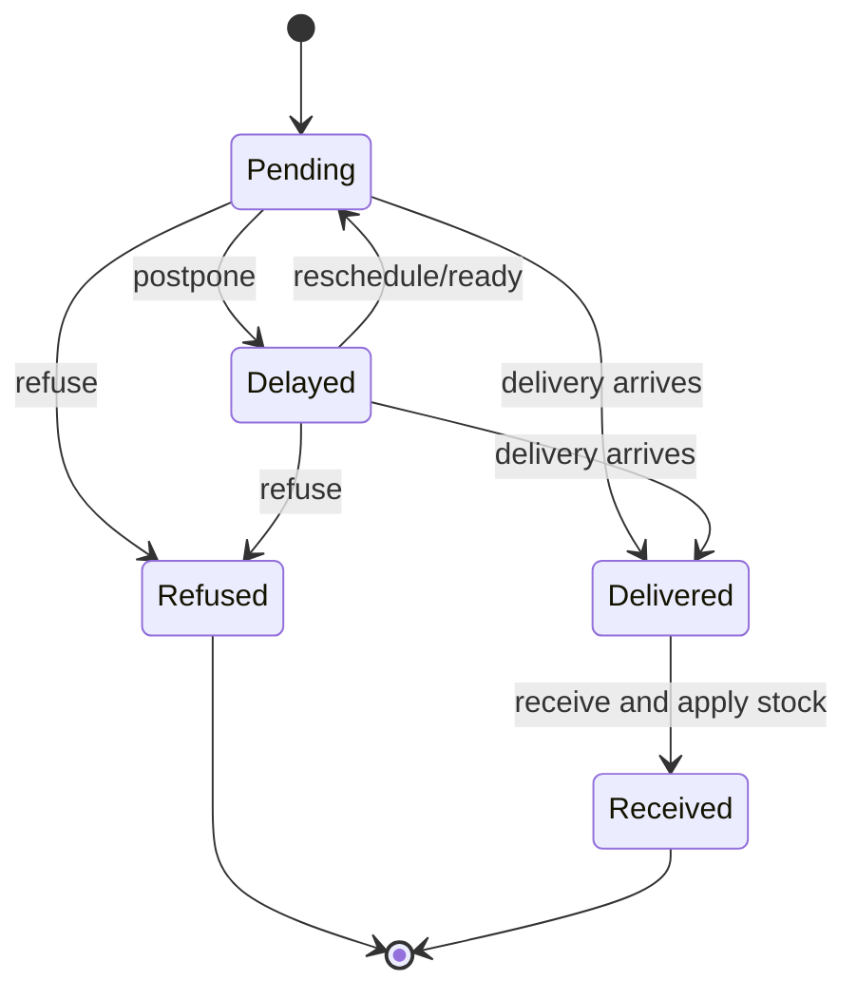

## 31. Failure Mode and Recovery Matrix

> **Purpose:** Document how the system behaves under each failure condition and what the current recovery path is.
> **Key Takeaway:** Every failure scenario has a defined detection point and explicit current behavior; there are no silent failures in the active API paths.
> **Risk:** Database-level failures (locked or unavailable SQLite file) have no automated recovery — manual service restart is the only current path.

| Failure Scenario | Detection Point | Current Behavior | Recovery Strategy |
|---|---|---|---|
| Invalid auth token | Auth dependency | 401 response | Re-login and token refresh in UI flow |
| Valid user but inactive account | Login handler | 403 response | Account reactivation path |
| Payload validation violation | Pydantic/schema checks | 422 response | Client-side normalization and retry |
| Stock conflict or missing row | Stock router/service | 404/409/400 response | Re-fetch state and retry action |
| Invalid order transition | Order workflow guards | 400 response | UI should refresh and show allowed actions |
| Local DB unavailable/locked | Connection or SQL execution | exception path | restart service / recover DB file |

## 32. Security Threat Model (Practical)

> **Purpose:** Identify realistic attack vectors against this application and map the current mitigations and gaps.
> **Key Takeaway:** Five threats are covered with five active mitigations; four recommended next steps identify the clearest current security gaps.
> **Risk:** Absence of login rate limiting and a token refresh flow are the highest-severity production gaps in the current security posture.

### Threats Considered

1. Credential stuffing and brute force login attempts
2. Token misuse on protected endpoints
3. Cross-location data access attempts by scoped users
4. Malformed payloads attempting to bypass business rules
5. User enumeration through auth responses

### Current Mitigations

1. Password policy + hashed storage
2. Bearer token required for protected APIs
3. User location scoping in query paths
4. Strict schema validation and transition guards
5. Generic invalid-credentials behavior in login

### Recommended Next Security Steps

1. Add login rate limiting
2. Add token expiration strategy with refresh flow
3. Add security audit trail for critical workflow actions
4. Add structured security event logging

## Part V - Operations and Scale

> **One-Slide Summary — Part V**
> - Current operational baseline: health endpoint, terminal logs, deterministic seed model, and test coverage
> - Recommended telemetry roadmap: structured JSON logs + per-route latency metrics + domain business KPIs + error budgets
> - Scalability path has four stages: SQLite → PostgreSQL → distributed cache → bounded context extraction
> - Each stage delivers discrete capability uplift without requiring a full architectural rewrite

### 33. Observability and Operations Blueprint

> **Purpose:** Describe the current operational baseline and provide a concrete roadmap toward production-grade observability.
> **Key Takeaway:** Health endpoint plus test coverage is the current baseline; the roadmap adds structured logs, per-route metrics, and business-level KPIs in prioritized order.
> **Risk:** Without correlation IDs or structured logs today, diagnosing multi-layer runtime issues requires manual log correlation.

#### Current Operational Baseline

- health endpoint for liveness
- deterministic local logs in terminal
- test-driven validation before changes

#### Recommended Instrumentation Roadmap

1. Structured JSON logging with correlation/request IDs
2. Endpoint latency metrics by route and status code
3. Domain-level business metrics:
   - order approval rate
   - shortage frequency
   - delayed supplier order ratio
4. Error budget tracking for workflow endpoints

#### Minimal Telemetry Architecture (Future)

```mermaid
flowchart LR
  API[FastAPI]
  LOG[Structured Logs]
  MET[Metrics Exporter]
  TRACE[Tracing Adapter]
  OBS[Observability Stack]

  API --> LOG
  API --> MET
  API --> TRACE
  LOG --> OBS
  MET --> OBS
  TRACE --> OBS
```

## 34. Scalability Evolution Path

> **Purpose:** Map the path from the current single-node SQLite runtime to a production-ready, horizontally-scalable architecture.
> **Key Takeaway:** Four progressive stages allow gradual migration; each stage delivers a discrete capability uplift without requiring a full architectural rewrite.
> **Risk:** Stage 2 (PostgreSQL migration) is the most disruptive transition; schema migration and connection pooling require careful coordination with the seed data pipeline.

### Stage 1 (Current)

- Single-node backend
- SQLite file persistence
- local-first developer/demo runtime

### Stage 2

- Introduce PostgreSQL
- Add migrations and connection pooling
- Add background jobs for heavy analytics refresh

### Stage 3

- API horizontal scaling behind reverse proxy
- dedicated cache for hot dashboard aggregates
- event-driven notifications and workflow side-effects

### Stage 4

- bounded context extraction for high-churn domains
- independent deployment pipelines per service domain

## Part VI - Presentation and Cleanup Appendix

> **One-Slide Summary — Part VI**
> - Five presentation-ready messages anchor the technical narrative: contract-first design, scoped security, split workflows, validation integrity, and a clear local-to-production path
> - Class diagram pruning rules provide deterministic cleanup guidance: trace from active routers, remove unreachable classes
> - Architecture is positioned to evolve: clean contracts, removed deprecated paths, and trade-offs explicitly documented

### 35. Presentation-Ready Key Messages

Use these concise technical messages in your talk:

1. The architecture is contract-first and workflow-centered.
2. Security and data scope are enforced at dependency and query boundaries.
3. Domain split (`clients` vs `suppliers`) removes ambiguity in order lifecycles.
4. Validation is not cosmetic; it protects domain integrity.
5. The current runtime is local-optimized, with a clear path to production-grade scaling.

## 36. Appendix: Suggested Class-Diagram Pruning Rules (When You Start Cleanup)

When you begin removing unused classes later, use these deterministic rules:

1. Keep only classes reachable from active router entry points.
2. Keep only entities touched by active SQL in mounted routers/services.
3. Remove classes bound exclusively to removed endpoints.
4. Remove frontend classes that do not call active context actions.
5. Preserve shared utility classes only if used by at least one active path.
