# Stock Optimizer Automotive - Technical Documentation

## 1. Purpose And Presentation Context

Stock Optimizer Automotive is a full-stack technical demo for automotive inventory operations. It helps a parts store or operations team understand what is available, what needs attention, how client demand affects stock, and when supplier replenishment is required.

The documentation is written for a technical audience seeing the application for the first time. It supports a university-style presentation with:

- 10 minutes presentation
- 5 minutes Q&A
- English delivery
- Technical audience
- Required topics: chosen theme, team, application architecture/design, technologies used
- Preferred live demo

## 2. Team Responsibilities

| Team Member | Area | Main Contribution |
|---|---|---|
| Paula | Backend | FastAPI backend, authentication, database access, domain routers, inventory/order workflows, API validation |
| Rayan | Frontend | Next.js and React UI, dashboard experience, catalog, stock management, orders workflow, notifications UX |
| Razvan | Machine Learning | Demand forecasting model, alert/recommendation generation, ML outputs that connect to backend notification and forecasting tables |

## 3. Application Summary

The application is an automotive stock optimization platform with these main capabilities:

- User authentication through JWT tokens.
- Automotive parts catalog with suppliers, categories, price, and availability.
- User-specific stock management for a store or company.
- Client order workflow with approve, deny, schedule, complete, and backorder behavior.
- Supplier order workflow with create, receive, postpone, and refuse behavior.
- Dashboard KPIs, demand chart, supplier map, market signals, and priority stock list.
- Notification center for client orders, supplier deliveries, backorders, stock alerts, and ML-generated alert rows.
- CSV-to-SQLite seed pipeline for reproducible local demo data.

The active app is split into two sibling projects:

- Backend workspace: `Stock_Optimizer`
- Frontend workspace: `frontend-master`

## 4. Technology Stack

| Layer | Technology | Version / Source | Responsibility |
|---|---|---|---|
| Frontend | Next.js | `16.2.4` from `frontend-master/package.json` | App Router pages, local development server, API rewrite |
| Frontend | React / React DOM | `19.2.3` | Component-based UI |
| Frontend | TypeScript | `latest` | Typed UI models and API shapes |
| Frontend | motion | `12.23.24` | Page and component transitions |
| Frontend | lucide-react | `0.487.0` | Icon system |
| Frontend | Tailwind CSS | `4.1.12` | Styling utility layer plus custom CSS |
| Backend | FastAPI | `0.115.0` | REST API, routing, dependency injection |
| Backend | Pydantic | Installed through FastAPI | Request validation and payload classes |
| Backend | Uvicorn | `0.30.0` | ASGI runtime |
| Backend | PyJWT | `2.8.0` | JWT token issuing and validation |
| Backend | bcrypt | `4.1.1` | Password hashing and verification |
| Backend | SQLite | Python standard library | Local file-based database |
| Testing | pytest | `8.3.3` | Backend regression tests |

## 5. High-Level Architecture

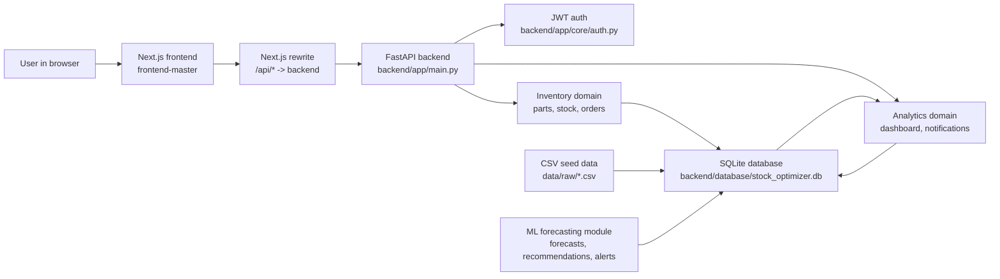

The frontend never reads SQLite directly. It calls relative `/api/...` routes. Next.js rewrites those calls to the backend using `frontend-master/next.config.mjs`:

```text
/api/:path* -> http://localhost:8000/:path*
```

Examples:

| Frontend Call | Backend Receives |
|---|---|
| `/api/auth/login` | `POST /auth/login` |
| `/api/parts/catalog` | `GET /parts/catalog` |
| `/api/stock` | `GET /stock` or `POST /stock` |
| `/api/orders/clients` | `GET /orders/clients` |
| `/api/dashboard/summary` | `GET /dashboard/summary` |
| `/api/notifications?generate=true` | `GET /notifications?generate=true` |

## 6. Repository Structure

```text
Stock_Optimizer/
|-- backend/
|   |-- app/
|   |   |-- main.py
|   |   |-- db.py
|   |   |-- core/
|   |   |-- infrastructure/
|   |   |-- inventory/
|   |   `-- analytics/
|   |-- database/
|   |   |-- schema.sql
|   |   `-- stock_optimizer.db
|   |-- scripts/
|   |-- tests/
|   |-- API.md
|   `-- DATABASE.md
|-- data/
|   `-- raw/
|-- ml/
|   `-- README.md
|-- docs/
|-- presentation/
|-- README.md
`-- RUN_LOCAL.md

../frontend-master/
|-- src/
|   `-- app/
|       |-- context/DemoStoreContext.tsx
|       |-- dashboard/
|       |-- components/
|       `-- pages/
|-- public/
|-- next.config.mjs
|-- package.json
`-- tsconfig.json
```

The active frontend is the sibling folder `../frontend-master`, not a frontend folder inside `Stock_Optimizer`.

## 7. Frontend Architecture

The frontend is a Next.js application with an App Router structure. The main UI is organized around authenticated dashboard pages.

Main frontend responsibilities:

- Render the application shell, sidebar, top navigation, and notification center.
- Store the auth token and current user in `localStorage`.
- Attach `Authorization: Bearer <token>` to authenticated API requests.
- Normalize backend payloads into frontend-friendly TypeScript models.
- Manage dashboard, catalog, stock, order, and notification state through `DemoStoreContext`.
- Provide the user-facing demo workflows for stock and orders.

Important frontend files:

| File | Responsibility |
|---|---|
| `src/app/context/DemoStoreContext.tsx` | Central API client, state provider, data normalization, workflow actions |
| `src/app/components/AppShell.tsx` | Session validation and protected shell behavior |
| `src/app/pages/Login.tsx` | Login form and token storage |
| `src/app/pages/Register.tsx` | Registration form |
| `src/app/pages/Dashboard.tsx` | KPIs, demand chart, supplier map, priority stock |
| `src/app/pages/Parts.tsx` | Catalog browsing and supplier order entry point |
| `src/app/pages/Stock.tsx` | Stock overview |
| `src/app/pages/StockManagement.tsx` | Stock create, update, delete workflow |
| `src/app/pages/Orders.tsx` | Client and supplier workflow screen |
| `src/app/components/NotificationCenter.tsx` | Notification drawer and toasts |

Frontend state model:

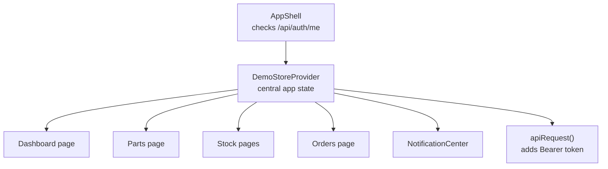

## 8. Backend Architecture

The backend is a FastAPI application organized by business domain.

Active routers registered in `backend/app/main.py`:

| Domain | Router | Main Paths |
|---|---|---|
| Auth | `app.infrastructure.routers.auth` | `/auth/register`, `/auth/login`, `/auth/me` |
| Health | `app.infrastructure.routers.health` | `/health` |
| Parts | `app.inventory.routers.parts` | `/parts`, `/parts/catalog` |
| Stock | `app.inventory.routers.stock` | `/stock` |
| Orders | `app.inventory.routers.orders` | `/orders/clients`, `/orders/suppliers` |
| Dashboard | `app.analytics.routers.dashboard` | `/dashboard/...` |
| Notifications | `app.analytics.routers.notifications` | `/notifications` |

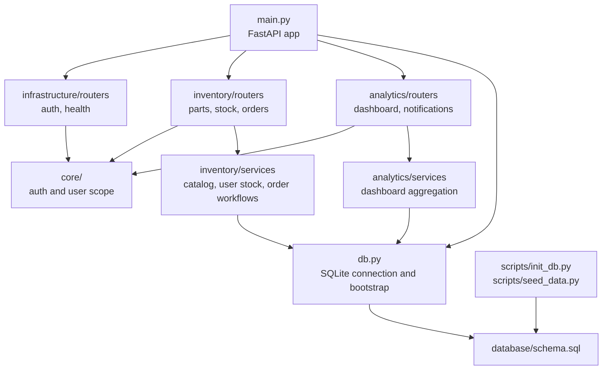

### Backend Layering Rules

- Routers own HTTP paths, dependencies, request parsing, and response status codes.
- Pydantic payload classes validate inputs such as stock quantities, order lines, and part metadata.
- Domain services own business behavior such as order allocation, supplier receiving, and dashboard aggregation.
- `app.db` owns database path resolution, bootstrap, connection creation, and foreign key activation.
- SQLite owns persisted local state.

## 9. Domain And Class Diagram

The application is not a classic object-oriented system with long-lived domain objects. React components, TypeScript data models, FastAPI routers, Pydantic payload classes, service functions, and SQLite tables form the real model. The diagram below represents the practical "class" view of the current codebase.

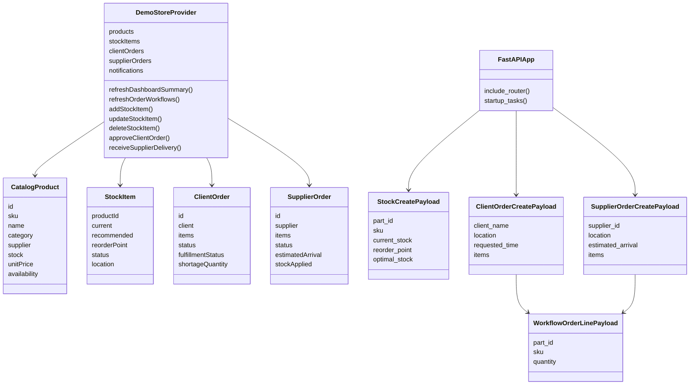

## 10. Database And Data Model

The database is SQLite. The schema is defined in `backend/database/schema.sql`, and the active local database path is resolved by `backend/app/db.py`.

Default database path:

```text
backend/database/stock_optimizer.db
```

The backend can bootstrap the schema on startup through `bootstrap_database_if_needed()`. Seed scripts load CSV files from `data/raw`.

### Logical Table Groups

| Group | Tables | Purpose |
|---|---|---|
| Security and access | `roles`, `users`, `user_location_scope`, `audit_log` | Auth, authorization, scope, traceability |
| Master data | `eu_locations`, `suppliers`, `parts` | Location, supplier, and catalog reference data |
| Inventory and order operations | `stock`, `user_stock`, `order_clients`, `order_client_lines`, `order_suppliers`, `order_supplier_lines` | Imported stock, user-owned stock, client workflow, supplier workflow |
| Analytics and history | `sales_history`, `inventory_snapshot`, `weather_daily`, `calendar_daily`, `calendar_events`, `demand_history` | Raw and derived data used for analytics and ML features |
| Forecasting and alerts | `forecasts`, `forecast_actuals`, `recommendations`, `notifications` | Forecast outputs, actuals, suggested actions, alert rows |

### Entity Relationship View

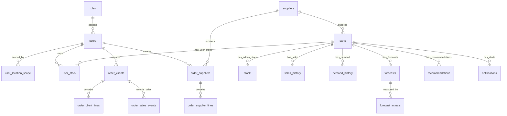

## 11. Dataset Detail

The dataset is stored in `data/raw`. It is designed to support an automotive inventory demo with historical demand, stock snapshots, weather and calendar signals, suppliers, parts, and European operating locations.

### CSV Files

| CSV File | Rows | Columns | Main Usage |
|---|---:|---:|---|
| `eu_locations.csv` | 12 | 10 | Location metadata such as city, country, climate, timezone, and coordinates |
| `suppliers.csv` | 8 | 5 | Supplier master records |
| `parts_master.csv` | 18 | 7 | Parts catalog with SKU, category, price, lead time, safety stock, and demand baseline |
| `inventory_snapshot.csv` | 216 | 5 | Current inventory rows loaded into operational stock |
| `sales_history.csv` | 157,896 | 39 | Combined historical sales and contextual demand features |
| `weather_daily.csv` | 8,772 | 15 | Weather features by date and location |
| `calendar_daily.csv` | 731 | 15 | Calendar and payday flags |
| `calendar_events.csv` | 9,328 | 16 | Location-aware events and campaign flags |
| `dataset_dictionary.csv` | 39 | 3 | Human-readable descriptions of dataset columns |

### Per-Location Sales Slices

There are 12 per-location sales files under `data/raw/by_location`. Each contains 19,728 rows:

```text
sales_CZ_PRG.csv
sales_DE_BER.csv
sales_DK_CPH.csv
sales_EE_TLL.csv
sales_ES_MAD.csv
sales_FI_HEL.csv
sales_FR_PAR.csv
sales_IT_MIL.csv
sales_NL_AMS.csv
sales_PL_WAW.csv
sales_RO_BUC.csv
sales_SE_STO.csv
```

### How Data Moves Through The App

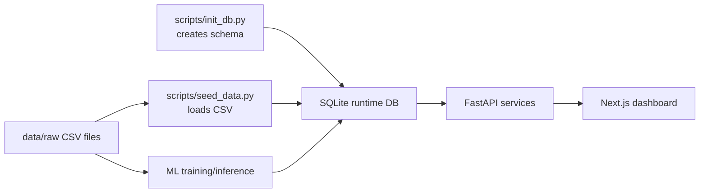

## 12. API Surface

Protected endpoints require:

```http
Authorization: Bearer <access_token>
```

### Auth

| Method | Path | Auth | Purpose |
|---|---|---|---|
| POST | `/auth/register` | No | Create a user account |
| POST | `/auth/login` | No | Validate credentials and return JWT plus user profile |
| GET | `/auth/me` | Bearer | Validate the current session and return user profile |

### Parts And Catalog

| Method | Path | Auth | Purpose |
|---|---|---|---|
| GET | `/parts` | Bearer | List raw/admin parts |
| GET | `/parts/catalog` | Bearer | Frontend-ready catalog with stock enrichment |
| GET | `/parts/catalog/filters` | Bearer | Filter options for catalog UI |
| GET | `/parts/catalog/{part_id}` | Bearer | Single catalog item |
| GET | `/parts/{part_id}` | Bearer | Single raw part record |
| POST | `/parts` | Admin | Create part |
| PATCH | `/parts/{part_id}` | Admin | Update part |
| DELETE | `/parts/{part_id}` | Admin | Delete part |

### Stock

| Method | Path | Auth | Purpose |
|---|---|---|---|
| GET | `/stock` | Bearer | Get current user's stock rows |
| GET | `/stock/{part_id}` | Bearer | Get stock for one part |
| POST | `/stock` | Bearer | Create or update a user stock row |
| PATCH | `/stock/{part_id}/{location}` | Bearer | Update stock quantities and policy fields |
| DELETE | `/stock/{part_id}/{location}` | Bearer | Delete one stock row |

### Orders

| Method | Path | Auth | Purpose |
|---|---|---|---|
| GET | `/orders/clients` | Bearer | Client order queue and history |
| POST | `/orders/clients` | Bearer | Create a client order |
| POST | `/orders/clients/random` | Bearer | Generate one demo client order |
| GET | `/orders/clients/{order_id}/availability` | Bearer | Preview fulfillment before approval |
| POST | `/orders/clients/{order_id}/approve` | Bearer | Approve order and allocate stock or create backorder |
| POST | `/orders/clients/{order_id}/deny` | Bearer | Deny client order |
| POST | `/orders/clients/{order_id}/schedule` | Bearer | Schedule client order |
| POST | `/orders/clients/{order_id}/complete` | Bearer | Complete fulfilled order and write sales events |
| GET | `/orders/suppliers` | Bearer | Supplier order queue and history |
| POST | `/orders/suppliers` | Bearer | Create supplier order |
| POST | `/orders/suppliers/{order_id}/receive` | Bearer | Receive supplier delivery and update stock |
| POST | `/orders/suppliers/{order_id}/postpone` | Bearer | Postpone delivery |
| POST | `/orders/suppliers/{order_id}/refuse` | Bearer | Refuse delivery |

### Dashboard And Notifications

| Method | Path | Auth | Purpose |
|---|---|---|---|
| GET | `/dashboard/summary` | Bearer | KPIs, sales flow, market trends, supplier locations, priority stock |
| GET | `/dashboard/sales-flow` | Bearer | Monthly sales/demand chart data |
| GET | `/dashboard/market-trends` | Bearer | Demand movement signals |
| GET | `/dashboard/supplier-locations` | Bearer | Supplier map markers |
| GET | `/dashboard/priority-stock` | Bearer | Manager action list |
| GET | `/notifications?generate=true` | Bearer | Workflow notifications, stock alerts, and generated demo order stream |

## 13. Runtime Sequence Diagrams

### 13.1 Frontend-To-Backend Request Flow

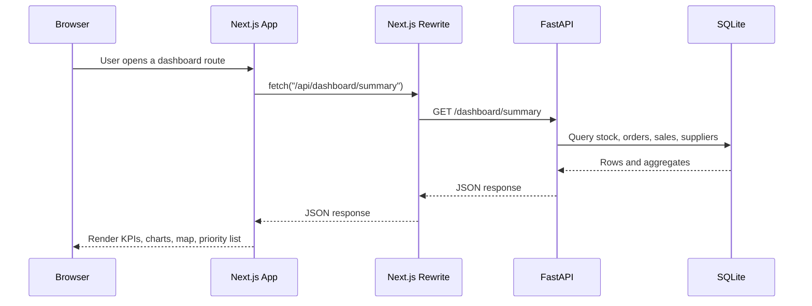

### 13.2 Auth/Login Sequence

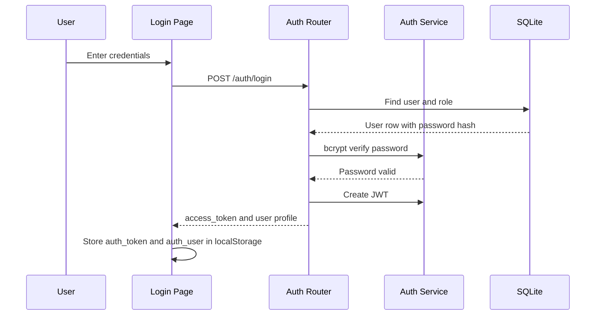

### 13.3 Dashboard Loading Sequence

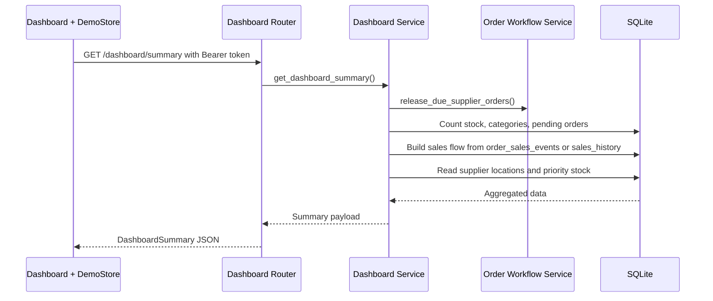

### 13.4 Stock CRUD Sequence

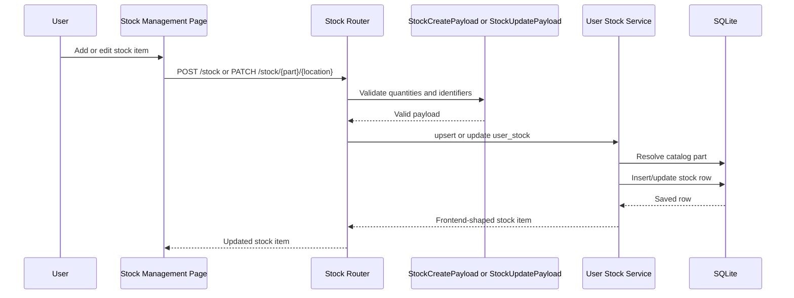

### 13.5 Client Order Approval And Backorder Sequence

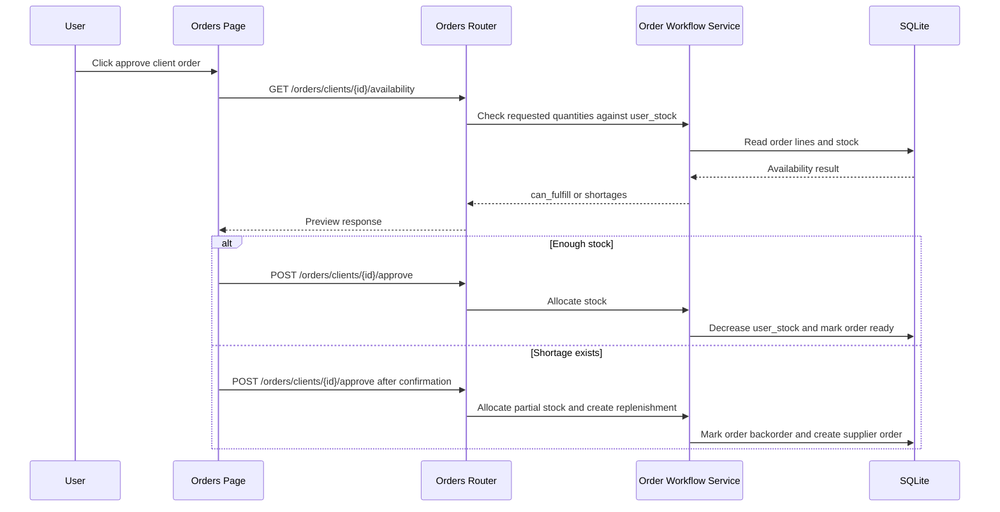

### 13.6 Supplier Delivery And Stock Update Sequence

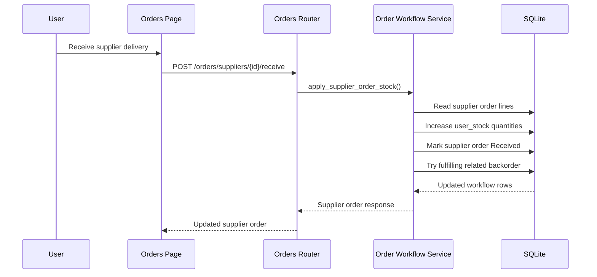

### 13.7 Notification Sequence

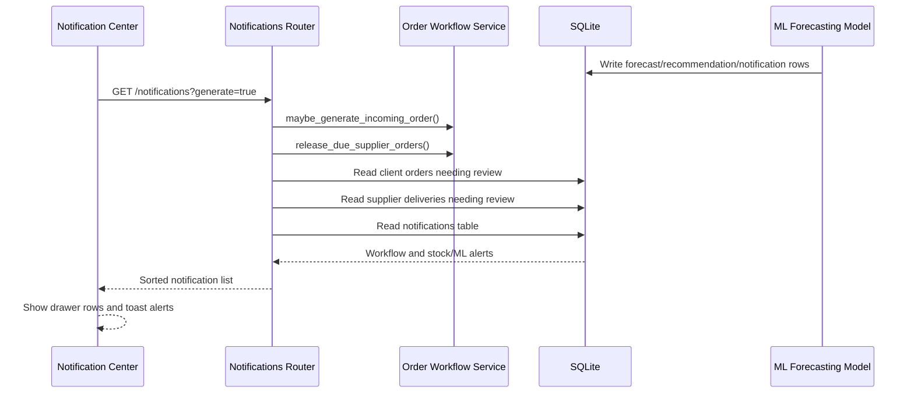

## 14. ML Forecasting And Alert Integration

Razvan's ML contribution is the forecasting and alert generation capability. The backend already contains tables and UI paths that can receive and display alert outputs:

- `forecasts`
- `forecast_actuals`
- `recommendations`
- `notifications`

The active notification endpoint already reads alert rows from the `notifications` table and returns them alongside workflow notifications. This makes the integration path straightforward:

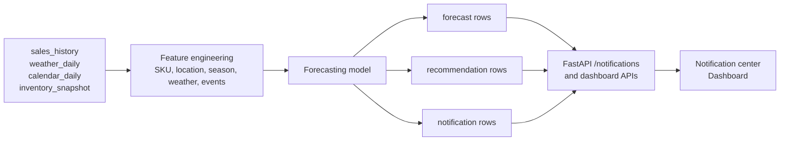

Recommended integration contract:

| Output | Target | Purpose |
|---|---|---|
| Forecast demand per SKU/location/date | `forecasts` | Store predicted demand and model metadata |
| Actual observed demand | `forecast_actuals` | Evaluate forecast quality after real or simulated demand arrives |
| Suggested action | `recommendations` | Reorder, monitor, reduce stock, or investigate anomaly |
| User-visible alert | `notifications` | Display critical/important messages in dashboard and notification center |

Source verification note: at the time this documentation package was generated, the repository contains the backend notification surface and ML integration README. The final presentation should re-check the exact ML code path after the forecasting integration is connected, then replace any generic wording with the concrete model name and import/write mechanism.

## 15. Key Workflows

### Dashboard Workflow

1. User logs in.
2. Frontend validates the session through `/api/auth/me`.
3. `DemoStoreContext` loads catalog, stock, dashboard summary, orders, and notifications.
4. Backend aggregates data from SQLite.
5. Dashboard renders KPIs, demand chart, supplier map, market trends, and priority stock.

### Stock Management Workflow

1. User opens Stock Management.
2. User selects a catalog part or edits an existing stock row.
3. Frontend sends `POST /api/stock` or `PATCH /api/stock/{part_id}/{location}`.
4. Backend validates the payload with Pydantic.
5. Backend writes to `user_stock`.
6. Frontend refreshes local stock state.

### Client Order Workflow

1. Client order appears in the Orders screen.
2. User previews stock availability.
3. If stock is available, approval allocates stock and marks the order ready.
4. If stock is missing, approval creates or links a backorder replenishment path.
5. When ready, the user completes the client order.
6. Backend records sales events in `order_sales_events`, which can feed dashboard sales flow.

### Supplier Order Workflow

1. User creates a supplier order from catalog/order UI.
2. Supplier order is tracked as pending or delivered.
3. User receives, postpones, or refuses delivery.
4. Receiving delivery increases stock.
5. Related client backorders can become ready to complete.

## 16. Security And Access

Authentication uses JWT bearer tokens:

- Passwords are hashed with bcrypt.
- Login returns an `access_token`.
- Frontend stores the token in `localStorage`.
- Authenticated requests send `Authorization: Bearer <token>`.
- Backend decodes and validates the token in `app.core.auth`.
- Admin-only endpoints use `require_admin`.
- Normal authenticated endpoints use `require_authenticated_user`.

Location scope exists for normal users:

- `user_location_scope` stores which locations a user can access.
- User-scoped reads filter stock/order data by user or location.
- Admin users can access broader imported/admin data.

## 17. Local Run Guide

Backend:

```bash
cd backend
.\venv\Scripts\Activate.ps1
pip install -r requirements.txt
python -m uvicorn app.main:app --reload
```

Frontend:

```bash
cd ..\frontend-master
npm install
npm run dev
```

Useful URLs:

| URL | Purpose |
|---|---|
| `http://localhost:3000` | Frontend app |
| `http://localhost:8000` | Backend root |
| `http://localhost:8000/docs` | FastAPI Swagger/OpenAPI docs |
| `http://localhost:8000/health` | Health check |

## 18. Demo Story For A Technical Audience

The strongest 10-minute story is:

1. Problem: automotive parts teams need visibility, fast order decisions, and proactive stock alerts.
2. Architecture: React/Next frontend calls FastAPI through `/api` rewrites; backend owns data rules and SQLite writes.
3. Data: realistic CSV seed data gives locations, parts, suppliers, sales history, weather, calendar, and stock snapshots.
4. Live workflow: dashboard -> catalog -> stock update -> client order approval/backorder -> supplier delivery -> notifications.
5. ML connection: forecasting converts historical demand and context into alerts/recommendations displayed in the existing notification surface.

## 19. Q&A Preparation

Likely technical questions:

| Question | Short Answer |
|---|---|
| Why FastAPI? | It gives a clean REST surface, Pydantic validation, automatic OpenAPI docs, and fast local iteration. |
| Why SQLite? | It is deterministic, local-first, easy to demo, and good enough for a self-contained technical prototype. |
| Why keep business rules in the backend? | Stock allocation, order status changes, and backorders must be consistent and should not depend on client-side state. |
| How does frontend talk to backend? | The frontend calls `/api/...`; Next.js rewrites to `http://localhost:8000/...`. |
| Where does dashboard data come from? | It is aggregated by backend services from stock, orders, suppliers, sales events, and CSV-seeded history. |
| How are notifications generated? | Workflow notifications come from orders and supplier deliveries; stock/ML alerts are read from the `notifications` table. |
| Is the ML model part of the runtime? | The integration target is the backend forecasting/notification tables. After the final ML connection, docs should name the exact model and write path. |
| What would change for production? | Use PostgreSQL, environment-specific secrets, migrations, background jobs, deployment pipelines, and stronger auth/session controls. |

## 20. Acceptance Checklist

- Architecture diagrams explain the system without reading code first.
- API section matches active routers registered in `backend/app/main.py`.
- Dataset counts match the current CSV files.
- Frontend/backend split matches `frontend-master/next.config.mjs`.
- Sequence diagrams cover auth, dashboard, stock CRUD, client orders, supplier delivery, and ML alert integration.
- Demo flow fits 10 minutes and leaves space for 5 minutes Q&A.
- ML section is accurate to the current repository and easy to finalize after the connected model code lands.
